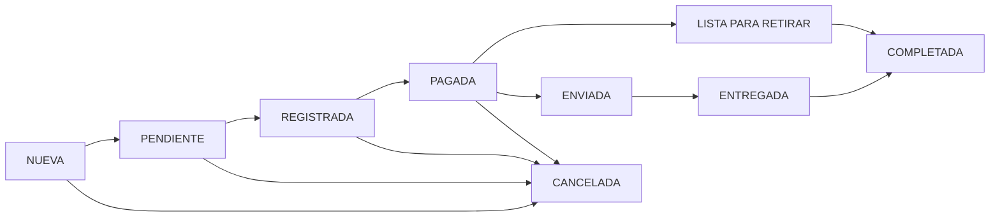
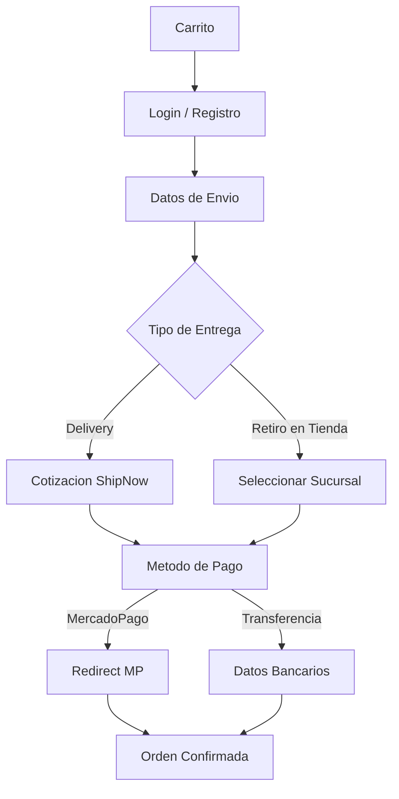

# AMIIN by Idraet Group - E-commerce Platform

**Plataforma e-commerce personalizada para la marca AMIIN de Idraet Group.** Diseno fiel a la identidad de marca, panel administrativo intuitivo, integracion con MercadoPago y ShipNow, multiples metodos de pago y gestion de tiendas fisicas con retiro en sucursal.

---

## Screenshots

### Pagina Principal

### Rutinas
<table>
  <tr>
    <td></td>
    <td></td>
    <td></td>
  </tr>
</table>

### Producto
<table>
  <tr>
    <td></td>
    <td></td>
    <td></td>
  </tr>
</table>

### Panel Administrativo
<table>
  <tr>
    <td></td>
    <td></td>
    <td></td>
  </tr>
</table>

### Emails con estados de pedido
<table>
  <tr>
    <td></td>
    <td></td>
    <td></td>
    <td></td>
  </tr>
</table>

### Emails de autenticación
<table>
  <tr>
    <td></td>
    <td></td>
  </tr>
</table>

---

## Stack Tecnico

<table>
<tr>
<td width="50%">

### Frontend
- **Componentes**: Livewire / Volt (reactivos, SPA-like)
- **Estilos**: TailwindCSS 3.4 + SCSS
- **Build**: Vite 6.0
- **Mapas**: Leaflet (ubicacion de tiendas)
- **Interactividad**: Alpine.js (integrado con Livewire)

</td>
<td width="50%">

### Backend
- **Framework**: Laravel 11 + Shopper Framework 2.1
- **Auth**: Sanctum + Socialite (Google OAuth)
- **Base de datos**: MySQL + Eloquent ORM
- **Pagos**: MercadoPago SDK (Checkout Pro + Bricks)
- **Envios**: ShipNow API (multi-carrier)
- **Admin**: Filament (panel extendido)

</td>
</tr>
</table>

---

<strong>Problema de Negocio & Solucion</strong>

### Problemas Identificados
- **Venta limitada a canales tradicionales**: Sin presencia digital propia para la venta directa de productos skincare
- **Gestion manual de pedidos**: Seguimiento por WhatsApp/email sin trazabilidad ni estados automatizados
- **Falta de identidad digital**: Necesidad de un e-commerce que refleje la estetica premium de la marca AMIIN
- **Envios sin automatizar**: Cotizaciones manuales con cada transportista, sin comparacion en tiempo real
- **Multiples puntos de venta**: Tiendas fisicas sin gestion centralizada de horarios y ubicaciones

### Solucion Implementada
- **E-commerce a medida**: Tienda online con diseno fiel a la marca, rutinas de skincare interactivas y catalogo completo
- **Checkout inteligente**: Flujo de compra con validacion de direcciones, cotizacion automatica de envios y multiples medios de pago
- **Panel administrativo**: Gestion completa de productos, ordenes, descuentos, newsletters y tiendas desde un solo lugar
- **Integraciones nativas**: MercadoPago para pagos, ShipNow para envios multi-carrier y Google OAuth para autenticacion
- **Notificaciones automaticas**: Emails transaccionales en cada cambio de estado del pedido

---

    

        <strong>
            Arquitectura del Sistema
        </strong>
    

    
### Flujo de Estados de Ordenes
    

### Flujo de Checkout

    

---

    

        Caracteristicas Principales
    

### Tienda Online
- Catalogo de productos con variantes, precios y stock
- Sistema de rutinas de skincare en 5 pasos interactivos
- Busqueda de productos y filtrado por categorias
- Lista de favoritos/wishlist por usuario
- Diseno responsive (mobile, tablet, desktop)

### Carrito & Checkout
- Carrito persistente con calculo automatico de totales
- Checkout en pasos: direccion, envio, pago, confirmacion
- Validacion de stock en tiempo real antes de confirmar
- Descuentos por cupon y campanas globales de descuento

### Medios de Pago
- **Tarjetas Credito/Debito**: Pago con tarjeta via MercadoPago checkout seguro
- **Transferencia bancaria**: Pago por deposito con instrucciones automaticas
- Actualizacion automatica del estado del pedido segun resultado del pago

### Envios Multi-Carrier (ShipNow)
- Cotizacion en tiempo real con multiples transportistas
- Envio a domicilio o retiro en sucursal del transportista
- Calculo automatico del costo de envio segun destino y peso

### Tiendas Fisicas
- Gestion de multiples sucursales con direccion y contacto
- Horarios de atencion por dia (7 dias, apertura/cierre)
- Estado en tiempo real (abierto/cerrado + proxima apertura)
- Mapa interactivo con ubicaciones (Leaflet)
- Retiro en tienda como opcion de envio en checkout

### Notificaciones por Email
- **Orden creada**: Confirmacion con resumen del pedido
- **Pago recibido**: Notificacion de pago aprobado
- **Lista para retirar**: Aviso cuando el pedido esta disponible en tienda
- **Enviada**: Informacion de despacho con datos de seguimiento
- **Completada**: Confirmacion de entrega exitosa
- **Cancelada**: Notificacion de cancelacion

### Panel Administrativo
- Gestion de productos: alta, baja, modificacion, variantes, secciones de contenido
- Gestion de ordenes: estados, pagos, envios, datos del cliente
- Descuentos: cupones, campanas globales, descuentos por suscriptor newsletter
- Marketing: newsletters con campanas, programacion y seguimiento
- Configuracion: tiendas, zonas de envio, metodos de pago, paginas legales
- Auditoria: registro de cambios con usuario, fecha y valores anteriores/nuevos

### Autenticacion & Seguridad
- Login con Google (OAuth 2.0) o email/contrasena
- Verificacion de email obligatoria
- Recuperacion de contrasena segura
- Roles y permisos para administradores

